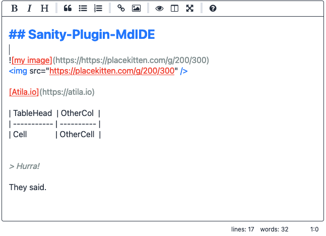
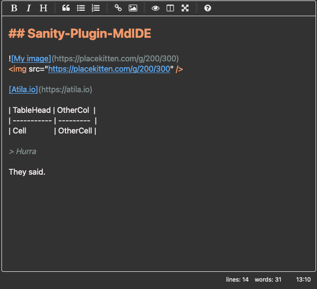

<div align="center">
 
</div>

# Sanity-Plugin-MdIDE

This is a wrapper on [React SimpleMDE Editor](https://github.com/RIP21/react-simplemde-editor) to be used on [Sanity](https://www.sanity.io/) Studio

## Installation 📦

```
sanity install sanity-plugin-mdide
```

## Usage 🚀

Just set type `markdown` to the field you wish to use.

```js
// ./schemas/post.js

export default {
  name: 'post',
  title: 'Post',
  type: 'document',
  fields: [
    {
      name: 'body',
      title: 'Body',
      type: 'markdown',
    },
  ],
}
```

## CSS customization 🎨

To fit well with Sanity Studio‘s design system. These variables come from `part:@sanity/base/theme/variables-style`.

The list of CSS custom properties:

- `--body-text`
- `--component-bg`
- `--hairline-color`
- `--border-radius-base`
- `--brand-primary`
- `--brand-secondary`

This also allows to easily adapt to any color pallete.

<details>
  <summary>Dark mode</summary>
  
</details>

<details>
  <summary>Light mode</summary>
  
</details>

## Configuration Options 🔧

Just is a very thin wrapper on top of [React SimpleMDE Editor](https://github.com/RIP21/react-simplemde-editor) and as such, it accepts every option [EasyMDE](https://github.com/Ionaru/easy-markdown-editor) supports. On your field schema, just pass an `options` object.

```js
export default {
  name: 'post',
  title: 'Post',
  type: 'document',
  fields: [
    {
      name: 'body',
      title: 'Body',
      type: 'markdown',
      options: {
        minHeight: '400px', // default is 500px
      },
    },
  ],
}
```

## Thanks 🙇‍♂️

- [Jeroen Akkerman](https://github.com/Ionaru) for maintaining [EasyMDE](https://github.com/Ionaru/easy-markdown-editor)
- [Andrey Los](https://github.com/RIP21) for maintaining [React SimpleMDE Editor](https://github.com/RIP21/react-simplemde-editor)
